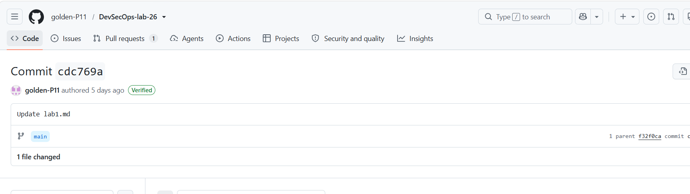

# Lab 3.1 — Submission

## Task 1: SSH Commit Signing

### Local configuration
- `git config --global gpg.format` → ssh
- `git config --global user.signingkey` → /home/the_anh/.ssh/id_ed25519.pub
- `git config --global commit.gpgsign` → true

### Local verification
Output of `git log --show-signature -1`:
<
commit cdc769aad3d98cd2fb0d6a0796ebc6eac3a99780 (HEAD -> feature/lab3.1, origin/main, origin/feature/lab3.1, origin/HEAD, main)                                                                                                                 gpg: directory '/home/the_anh/.gnupg' created                                                                           gpg: keybox '/home/the_anh/.gnupg/pubring.kbx' created                                                                  gpg: Signature made Sun Jul 26 14:22:30 2026 UTC                                                                        gpg:                using RSA key B5690EEEBB952194                                                                      gpg: Can't check signature: No public key                                                                               Author: P11Cyber <huynhducphu1203@gmail.com>                                                                            Date:   Sun Jul 26 21:22:30 2026 +0700
 — should include "Good "git" signature for ">

### GitHub verification
- Direct link to your most recent commit on GitHub: https://github.com/golden-P11/DevSecOps-lab-26/commit/cdc769aad3d98cd2fb0d6a0796ebc6eac3a99780
- Screenshot of the Verified badge:

### One-paragraph reflection (2-3 sentences)
What STRIDE-R (Repudiation) scenario would a forged-author commit enable in a real team's codebase? How does the Verified badge make that attack visible?